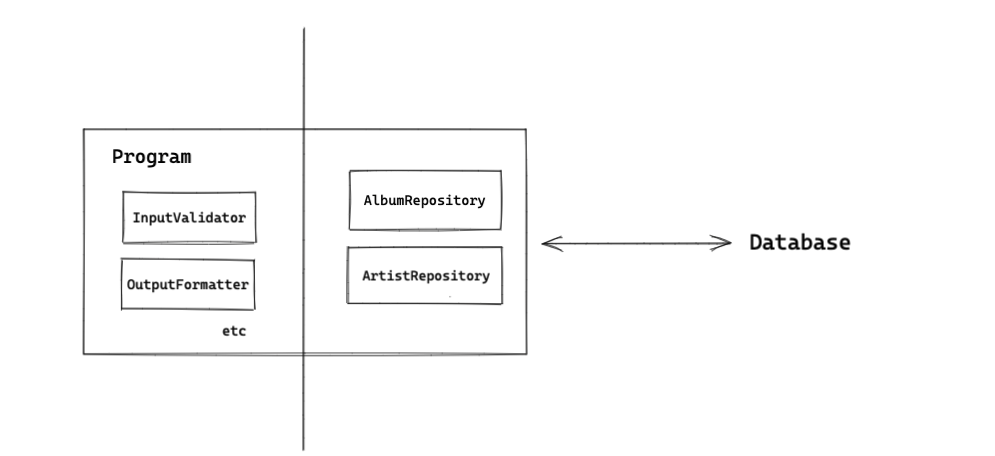

# Wrapping the program in an Application class

You've built Repository and Model classes to provide an interface to the database. These
classes' job is to make the bridge between the rest of our program and the database. It's
often called the **database layer** or **model layer**.

If we split our program into different "layers" depending on what their job is, we can see
two different ones appearing — the database layer, and the rest of our program, which
usually contains all the program logic.

On the diagram below, you can see this split — the part on the right is the database layer
containing the Model and Repository classes learned in this module.



Therefore, our program needs at least one class as part of its "core" layer.

## The Application class interface

This class wraps the other layer — it acts as an entrypoint to our program:

```python
# file: app.py

from lib.artist_repository import ArtistRepository
from lib.database_connection import DatabaseConnection

class Application():
  def __init__(self):
    self._connection = DatabaseConnection()
    self._connection.connect()
    self._connection.seed("seeds/music_library.sql")

  def run(self):
    # "Runs" the terminal application.
    # It might:
    #   * Ask the user to enter some input
    #   * Make some decisions based on that input
    #   * Query the database
    #   * Display some output
    # We're going to print out the artists!

    artist_repository = ArtistRepository(self._connection)
    artists = artist_repository.all()

    for artist in artists:
        print(f"{artist.id}: {artist.name} ({artist.genre})")

if __name__ == '__main__':
    app = Application()
    app.run()
```

<details>
  <summary>:speech_balloon: What is all that `__name__ == '__main__'` stuff?</summary>

  `if __name__ == '__main__'` means "only run this code if you're running this
  file directly, and not if you're importing it from another file".

  If you'd like to learn more, you can read more about it
  [here](https://realpython.com/if-name-main-python/).

</details>

## Exercise

Flesh out the class above to implement the `run` method for the `music_library`
project.

It should work like this:

```shell
; pipenv shell
; python app.py

Welcome to the music library manager!

What would you like to do?
 1 - List all albums
 2 - List all artists

Enter your choice: 1
[ENTER]

Here is the list of albums:
 * 1 - Doolittle
 * 2 - Surfer Rosa
 * 3 - Waterloo
 * 4 - Super Trouper
 * 5 - Bossanova
 * 6 - Lover
 * 7 - Folklore
 * 8 - I Put a Spell on You
 * 9 - Baltimore
 * 10 -	Here Comes the Sun
 * 11 - Fodder on My Wings
 * 12 -	Ring Ring
```

Don't worry about tests for the `Application` class. Automated tests for
terminal applications can take a bit of work, and in the next module we're going
to replace this layer with a web interface, so we can cover testing then.


<!-- BEGIN GENERATED SECTION DO NOT EDIT -->

---

**How was this resource?**  
[😫](https://airtable.com/shrUJ3t7KLMqVRFKR?prefill_Repository=makersacademy%2Fdatabases-in-python&prefill_File=challenges%2F08_wrapping_in_application_class.md&prefill_Sentiment=😫) [😕](https://airtable.com/shrUJ3t7KLMqVRFKR?prefill_Repository=makersacademy%2Fdatabases-in-python&prefill_File=challenges%2F08_wrapping_in_application_class.md&prefill_Sentiment=😕) [😐](https://airtable.com/shrUJ3t7KLMqVRFKR?prefill_Repository=makersacademy%2Fdatabases-in-python&prefill_File=challenges%2F08_wrapping_in_application_class.md&prefill_Sentiment=😐) [🙂](https://airtable.com/shrUJ3t7KLMqVRFKR?prefill_Repository=makersacademy%2Fdatabases-in-python&prefill_File=challenges%2F08_wrapping_in_application_class.md&prefill_Sentiment=🙂) [😀](https://airtable.com/shrUJ3t7KLMqVRFKR?prefill_Repository=makersacademy%2Fdatabases-in-python&prefill_File=challenges%2F08_wrapping_in_application_class.md&prefill_Sentiment=😀)  
Click an emoji to tell us.

<!-- END GENERATED SECTION DO NOT EDIT -->
